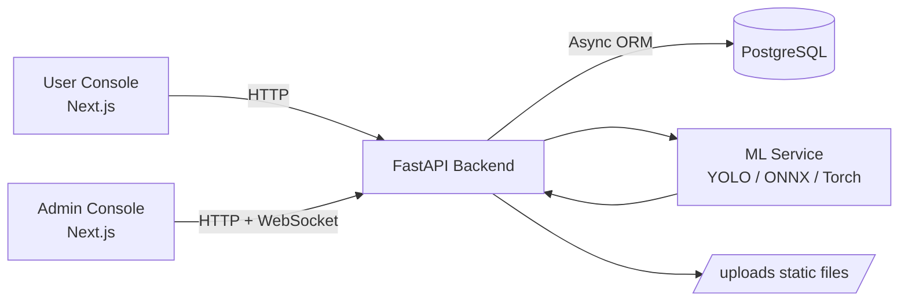
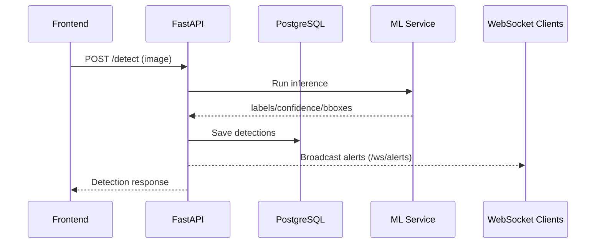
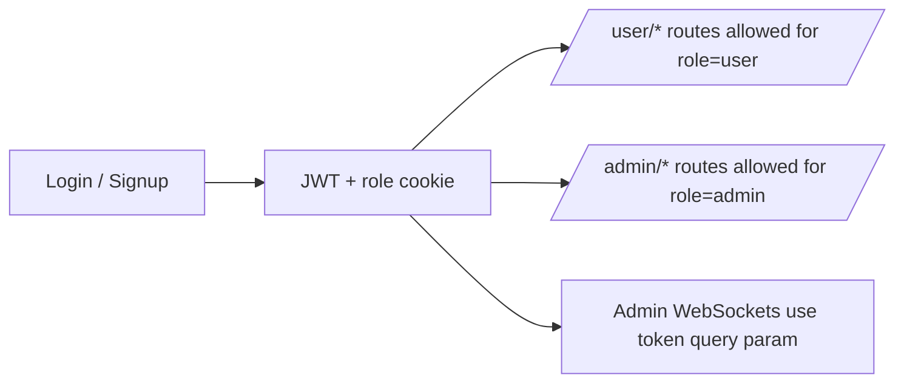

# NeuroRail

AI-powered railway surveillance and safety platform with:
- real-time incident alerts,
- ML-based object detection,
- lost & found matching,
- role-based admin/user consoles.

## Table of Contents
- [Overview](#overview)
- [Architecture](#architecture)
- [Core Features](#core-features)
- [Tech Stack](#tech-stack)
- [Repository Structure](#repository-structure)
- [Quick Start](#quick-start)
- [Configuration](#configuration)
- [Run the System](#run-the-system)
- [API and WebSocket Endpoints](#api-and-websocket-endpoints)
- [Main Workflows](#main-workflows)
- [Troubleshooting](#troubleshooting)

## Overview

NeuroRail combines FastAPI, PostgreSQL, and a Next.js frontend to monitor railway-related safety events and manage lost-item recovery flows.  
The backend serves REST + WebSocket APIs, while the frontend provides separate admin and user experiences.

## Architecture



### Runtime Data Flow



## Core Features

- **Detection API** for uploaded images (`/detect`)
- **Live alert stream** over WebSocket (`/ws/alerts`)
- **Lost & found pipeline** with AI-assisted case matching
- **Admin capabilities**: users, reports, alerts, live summary, match verification
- **User capabilities**: register/login, submit lost cases, track personal cases/results
- **Accuracy and intelligence streams** for admin dashboards (`/ws/accuracy`, `/ws/intel`)

## Tech Stack

- **Backend**: FastAPI, SQLAlchemy (async), psycopg, python-jose, passlib
- **Frontend**: Next.js App Router, React, TypeScript, Tailwind CSS
- **ML**: Ultralytics YOLO (+ optional ONNX Runtime / Torch / joblib loaders)
- **Database**: PostgreSQL

## Repository Structure

```text
NeuroRail/
├── backend/                  # FastAPI app, routes, services, models, schemas
│   └── app/
│       ├── main.py           # API app + WebSockets + router registration
│       ├── routes/           # REST endpoints
│       ├── services/         # ML, matching, alert, accuracy, auth logic
│       ├── models/           # SQLAlchemy models
│       └── core/             # config + auth helpers
├── frontend/                 # Next.js app (admin + user consoles)
│   └── src/
│       ├── app/              # route pages
│       ├── components/       # UI components
│       └── lib/              # API clients + socket hooks
├── ml-model/                 # model artifacts / training assets
└── README.md
```

## Quick Start

### Prerequisites

- Python 3.10+
- Node.js 18+
- PostgreSQL running locally

### 1) Backend setup

```bash
cd backend
python -m venv .venv
# Linux/macOS
source .venv/bin/activate
# Windows
# .venv\Scripts\activate

pip install -r requirements.txt
```

### 2) Configure backend environment

Create `backend/.env` with:

```env
DATABASE_URL=postgresql+psycopg://<user>:<password>@localhost:5432/<db_name>
JWT_SECRET=<strong-random-secret>
```

### 3) Frontend setup

```bash
cd frontend
npm install
```

## Configuration

### Backend
- `DATABASE_URL` (required)
- `JWT_SECRET` (required)

### Frontend (`frontend/.env.local`)
- `NEXT_PUBLIC_API_BASE_URL` (default: `http://127.0.0.1:8000`)
- `NEXT_PUBLIC_WS_URL` (default: `ws://127.0.0.1:8000`)
- `NEXT_PUBLIC_USE_MOCK_AUTH` (`true` enables mock login fallback)
- `NEXT_PUBLIC_DEBUG` (`true` enables extra diagnostics in dev)

## Run the System

### Start backend

```bash
cd backend
python -m uvicorn app.main:app --reload --port 8000
```

### Start frontend

```bash
cd frontend
npm run dev
```

Then open: `http://localhost:3000`

## API and WebSocket Endpoints

### Key REST endpoints

- `GET /health` — backend + DB health check
- `POST /auth/register` — create account
- `POST /auth/login` — login
- `POST /mock-login` — development mock token flow
- `POST /detect` — run object detection on an uploaded image
- `GET /detect/status` — model readiness
- `POST /lost-item` — submit lost item (legacy path)
- `POST /lost-found` — submit lost item case
- `GET /lost-found/mine` — list own cases
- `GET /lost-found/admin` — admin list of all cases
- `PATCH /lost-found/admin/{case_id}` — admin status update
- `POST /detections/ingest` — ingest surveillance detections
- `GET /matches/{case_id}` — list generated matches
- `PATCH /matches/match/{match_id}` — verify/reject match

### WebSockets

- `/ws/alerts` — live alert feed
- `/ws/lost-found-matches` — live match notifications
- `/ws/accuracy` — live accuracy metrics (admin token required)
- `/ws/intel` — live safety intelligence events (admin token required)

## Main Workflows

### Lost & Found Workflow

```mermaid
flowchart TD
    U[User submits case<br/>POST /lost-item or /lost-found] --> C[Case saved + image embedding]
    I[Surveillance ingestion<br/>POST /detections/ingest] --> M[Matching service scores candidates]
    C --> M
    M --> R[Match records created]
    R --> A[Admin reviews /matches/{case_id}]
    A --> V[PATCH /matches/match/{match_id}<br/>verify/reject]
```

### Auth + Role Routing



## Troubleshooting

- If frontend cannot reach backend, verify `NEXT_PUBLIC_API_BASE_URL` and backend port (`8000`).
- If admin pages redirect unexpectedly, verify `nr_token` and `nr_role` cookies are set after login.
- If WebSockets fail, confirm `NEXT_PUBLIC_WS_URL` and token availability (admin streams require auth token).
- If model status is not ready, check `GET /detect/status` and model artifacts under `ml-model/`.

---

For deeper operational notes, see additional project docs in the repository root (debug/setup/verification guides).
